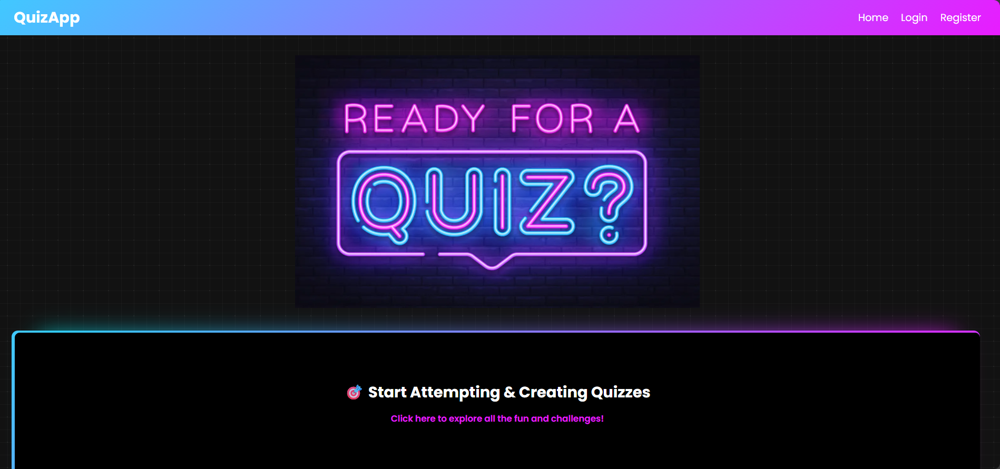
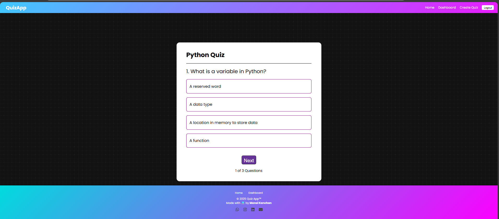
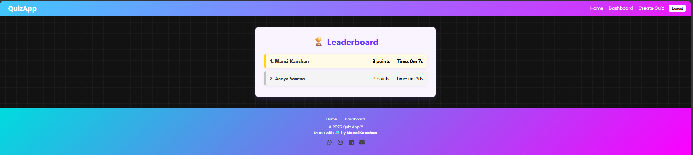
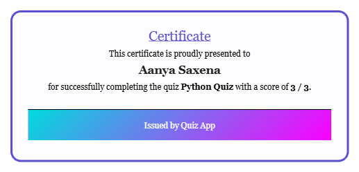

# Quizz App 🎓

An interactive and user-friendly web application that allows users to **create**, **attempt**, and **share quizzes**. Built with React + Firebase, this app supports real-time quiz results, leaderboards, and downloadable certificates.

---

## 🚀 Features

- 🧠 Attempt multiple quizzes with live scoring
- 📝 Create your own quizzes with custom questions and answers
- 🏆 Leaderboard for top scores
- 🖨️ Downloadable certificate after quiz completion
- 🔐 Firebase Authentication (Login/Signup)
- 📂 Data storage with Firebase Firestore
- 📱 Responsive design for all devices

---

## 🛠️ Tech Stack

- **Frontend:** React, Vite, CSS
- **Backend/Database:** Firebase Authentication + Firestore
- **Deployment:** GitHub Pages (or Netlify)

---
## 📸 Screenshots

| Home Page | Quiz Page |
|-----------|-----------|
|  |  |

| Leaderboard | Certificate |
|-------------|-------------|
|  |  |


## 🔧 Setup Instructions

```bash
# Clone the repository
git clone https://github.com/mansikanchan2003/quizz-app.git

# Navigate to the project directory
cd quizz-app

# Install dependencies
npm install

# Start the development server
npm run dev
